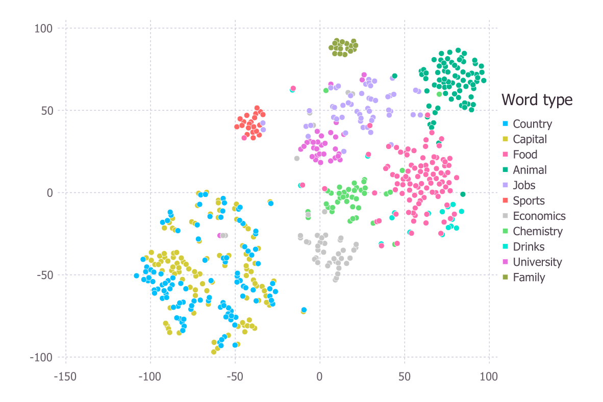
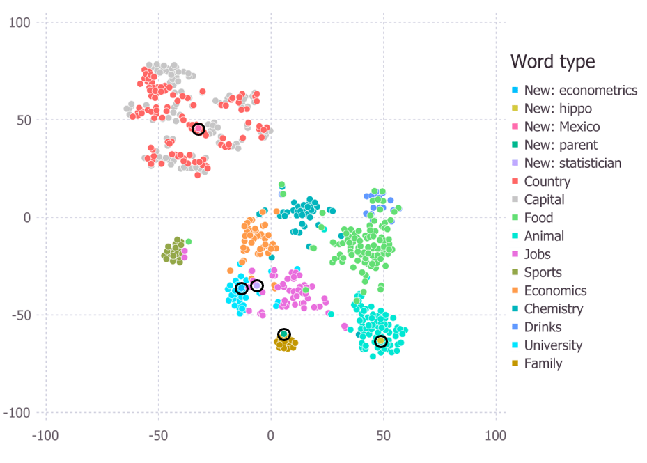

# t-SNE
An enhanced t-SNE implementation in Julia

Features: 
- The original t-SNE in Julia
- Various additional initialization options 
- Exaggeration at the first and last few iterations
- Local perplexity scaling that complements global perplexity
- Efficient new point insertion into an existing t-SNE output

### Example of basic t-SNE output

### Example of t-SNE output with local perplexity scaling and newly inserted points

  

